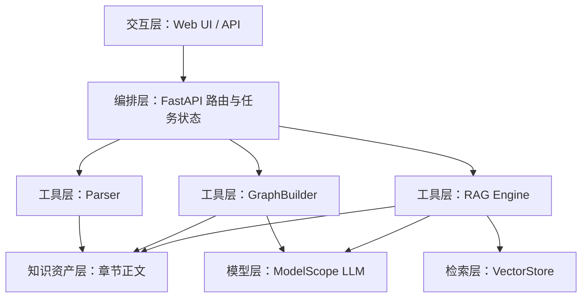

# Agent 架构说明

## Agent 定位

本系统的 Agent 不是单轮问答机器人，而是围绕教材知识整合任务组织的一组工具化流程。它接收教材、理解章节、调用模型抽取知识、构建图谱，并在问答时回到教材原文寻找证据。

## 架构分层

## 关键决策

### 先解析再生成

系统先将教材转为统一结构，再进行图谱和问答。这样可以把格式差异隔离在 Parser 内部，后续模块只依赖统一的 `Textbook` / `Chapter` 模型。

### 分块调用模型

整本教材直接输入模型不可行，成本高且上下文超限。因此图谱生成和 RAG 都以章节或分块为单位处理，再在系统侧合并结果。

### 结构化输出约束

知识图谱抽取要求模型输出节点和边，节点包含名称、定义、类别、章节、页码、来源片段；边包含源节点、目标节点、关系类型和描述。这样便于校验、合并和可视化。

### 原文可追溯

RAG 回答必须附带来源编号，来源结构中保留教材、章节、页码和摘录。评审时可以检查答案是否真的来自教材内容。

## Agent 工作流

1. 解析工具读取教材，生成章节结构。
2. 清洗工具去除目录、数字资源、索引等噪声。
3. 图谱工具选择章节并按长度分块。
4. LLM 抽取局部知识点与关系。
5. 合并器按规范化名称去重，生成单本图谱。
6. 聚合器将多本教材图谱按知识点名称合并。
7. RAG 工具将章节切块、向量化、检索。
8. LLM 在检索片段内回答问题并输出来源。

## 创新点

- 面向通用教材，而不是七本书的硬编码脚本。
- 正文存储与导出结构分离，既满足赛题 JSON，又避免长期维护超大 JSON。
- 章节识别结合标题规则、噪声过滤和页码连续性，降低目录误识别。
- 知识图谱与 RAG 共用解析后的教材资产，减少重复处理。
- 图谱节点拖拽采用局部边更新，交互更自然。
- 重复上传使用内容指纹治理，适合多人调试和批量测试。

## 取舍与限制

- 当前章节识别主要基于文本规则，对复杂版式和扫描版 PDF 仍有局限。
- 知识图谱抽取依赖大模型质量，可能存在漏抽和关系偏差。
- 向量索引使用本地文件存储，适合比赛演示；生产环境建议迁移到专业向量数据库。
- 免费云部署通常磁盘不持久，正式使用需要配置持久化卷或对象存储。
