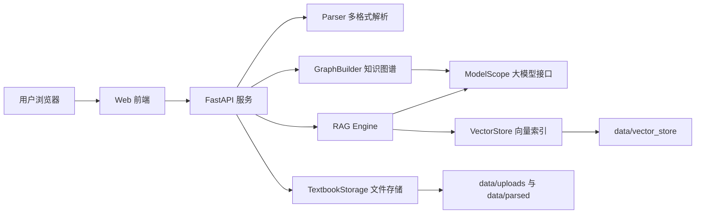

# 系统设计

## 总体架构



## 数据流

1. 用户上传教材文件。
2. 后端保存原文件并计算 SHA-256。
3. 若文件已存在，直接返回已有教材记录。
4. Parser 按格式提取文本，清洗噪声，识别章节。
5. Storage 将元信息和章节正文分开保存。
6. 前端展示教材列表与章节结构。
7. 用户触发知识图谱生成，GraphBuilder 按章节分块调用大模型。
8. 系统合并知识点、关系并保存图谱。
9. 用户触发 RAG 索引，Chunker 分块，VectorStore 写入嵌入向量。
10. 用户提问时，RAG Engine 检索片段并调用模型生成带来源答案。

## 技术选择

| 模块 | 选择 | 原因 |
| --- | --- | --- |
| Web 服务 | FastAPI | 类型提示友好，API 开发快，适合异步任务 |
| PDF 解析 | pypdf | 轻量、无需外部服务，适合文本型 PDF |
| DOCX 解析 | python-docx | 稳定读取 Word 段落 |
| 大模型 | ModelScope 兼容接口 | 符合赛题模型环境，接口形式接近 OpenAI |
| 向量模型 | BAAI/bge-small-zh-v1.5 | 中文检索效果较好，部署成本相对可控 |
| 前端 | 原生 HTML/CSS/JS | 减少构建依赖，便于评审直接运行 |
| 部署 | Docker / Render | 让依赖和启动命令可复现 |

## 存储设计

```text
data/
  uploads/
    book_xxx.pdf
  parsed/
    book_xxx/
      meta.json
      knowledge_graph.json
      chapters/
        ch_001.txt
  vector_store/
    book_xxx/
      meta.json
      embeddings.npy
```

章节正文拆分为独立文本文件，避免单个 JSON 过大；导出时再组装为赛题要求的统一 JSON。

## API 概览

- 教材管理：上传、列表、详情、删除、导出。
- 图谱生成：同步生成、异步任务生成、任务进度查询、聚合图谱。
- RAG：索引单本、索引全部、状态查询、问答。

详细接口见 [接口文档](./接口文档.md)。

## 前端交互设计

界面以“教材管理 + 知识图谱 + RAG 问答”为主工作流：

- 左侧保留教材列表和上传入口。
- 主区域展示所选教材的章节结构。
- 图谱区域支持缩放、平移和节点拖拽。
- 问答区域展示答案及来源片段，便于回溯原文。

## 可扩展点

- OCR：为扫描版 PDF 增加 OCR 管线。
- 章节检测：引入版面信息和目录页辅助校验。
- 图谱校验：增加模型二次审查或人工确认。
- 持久化：生产环境可替换为对象存储和数据库。
